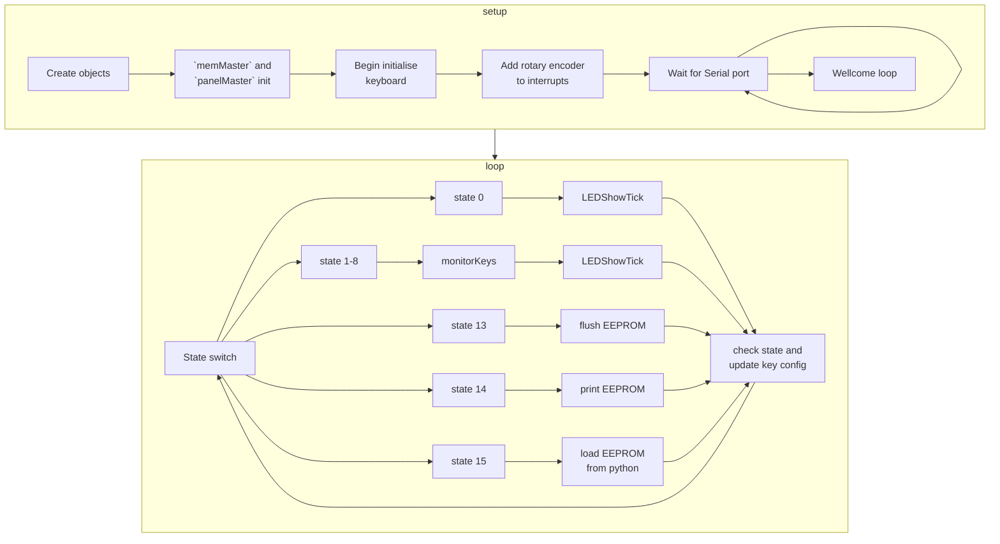

# 10key_macro

A DIY project building an Arduino-based macro keyboard with a 4-bit switch and rotary encoder.

# Background

<!-- The reason for creating this project/ -->
<!-- the why this project is important -->

A number of years ago, I used to learn PIC18 microcontroller and programming using `assembly language`. One of the concepts is using a polling technique to get the button response. Since then I have conducted deep research into designing customized keyboards. Despite there being a huge number of existing projects on the internet, I did want to implement them myself.

# Description

<!-- Describe what it is and what it is included -->

This project mainly consists of four parts. Circuit design, enclosure design, Arduino coding, Python coding.

1. Circuit design

The circuit schematic was built on the EasyEDA platform and is now being ported to KiCAD.


The circuit consists of a microcontroller, 10 cherry keys with 2812 LEDs, an IC74165, an EEPROM AT24C64, a rotary encoder and a 4-bit toggle switch.

By following the schematic, the main circuit was built on a proof board and connected to keys and LEDs through wires.


2. Enclosure design

The enclosure is designed for multiple layers of 4.5mm and 4mm acrylic. The enclosure however begins to fall apart due to aging. A 3D-printed version designed will be reproduced later.


3. Arduino coding

The fundamental idea of the Arduino code design is framing. There are two parts of the Arduino code structure, `setup` and `loop`. I initialize all objects as well as pin I/O in `setup` section; and perform LED and key checks in the loop.



The state is determined by the toggle switch which is capable of 16 values (0 -> 15) and additional functions can be added through the addition of new cases to the `switch`.

| swich pattern | code |                     feature                     |                            description                            |
| :-----------: | :--: | :---------------------------------------------: | :---------------------------------------------------------------: |
|     0000      |  0   |                   LED display                   |        Complete LED loop through all supported LED effects        |
|     0001      |  1   |                     mode 1                      |                                                                   |
|     0010      |  2   |                     mode 2                      |                                                                   |
|     0011      |  3   |                     mode 3                      |                                                                   |
|     0100      |  4   |                     mode 4                      |                                                                   |
|     0101      |  5   |                     mode 5                      |                                                                   |
|     0110      |  6   |                     mode 6                      |                                                                   |
|     0111      |  7   |                     mode 7                      |                                                                   |
|     1000      |  8   |                     mode 8                      |                                                                   |
|     1101      |  13  | Flush EEPROM <br> (need to modify Arduino code) |             Replace all values in the EEPROm by 0xFF              |
|     1110      |  14  |                  Print Key map                  | Automatically print whole EEPROM content <br> `-` represents 0xFF |
|     1111      |  15  |              Load key map from PC               |    Enter this mode, use Python to pass mapping json to Arduino    |

4. Python coding

To configure each key output in each mode, a predefined JSON file is created and can be loaded to EEPROM. Arduino will load the specific chunk from EEPROM to update each key config.

|             Key in object              |                                         Description                                          |            Example            |
| :------------------------------------: | :------------------------------------------------------------------------------------------: | :---------------------------: |
|                  Mode                  |           `"mode-xxxx"` <br> where xxxx is the binary representation of the state            |         `"mode-0001"`         |
|               Key index                |                 From `"0"` to `"9"` represents the key index of the keyboard                 |             `"0"`             |
|         default string `"str"`         |    `"mx string test - y"` where x is the mode from `1` to `8` and <br> y is the key index    |    `"m1 string test - 1"`     |
| default key <br> binding list `"list"` |                  The list of keybinding that will be `pressed` all in once                   | `["KEY_LEFT_GUI", "r", null]` |
|       default key mode `"mode"`        | `1` means print string, `0` means press key binding in the list and `2` means press and hold |              `1`              |

<details>
<summary> Default configuration JSON file</summary>

```json
{
    "mode-0001": {
        "0": {
            "str": "m1 string test - 0, intentionally make a long string for testing",
            "list": ["KEY_DELETE", null, null],
            "mode": 1
        },
        "1": {
            "str": "m1 string test - 1",
            "list": ["KEY_LEFT_GUI", "r", null],
            "mode": 0
        },
        "2": {
            "str": "m1 string test - 2",
            "list": ["KEY_DELETE", null, null],
            "mode": 0
        },
        "3": {
            "str": "m1 string test - 3",
            "list": [null, null, null],
            "mode": 1
        },
        "4": {
            "str": "m1 string test - 4",
            "list": [null, null, null],
            "mode": 1
        },
        "5": {
            "str": "m1 string test - 5",
            "list": [null, null, null],
            "mode": 1
        },
        "6": {
            "str": "m1 string test - 6",
            "list": [null, null, null],
            "mode": 1
        },
        "7": {
            "str": "m1 string test - 7",
            "list": [null, null, null],
            "mode": 1
        },
        "8": {
            "str": "m1 string test - 8",
            "list": [null, null, null],
            "mode": 1
        },
        "9": {
            "str": "m1 string test - 9",
            "list": [null, null, null],
            "mode": 1
        }
    },
    "mode-0010": {
        "0": {
            "str": "",
            "list": [null, null, null],
            "mode": 2
        },
        "1": {
            "str": "m2 string test - 1",
            "list": [null, null, null],
            "mode": 0
        },
        "2": {
            "str": "m2 string test - 2",
            "list": ["KEY_LEFT_GUI", "s", null],
            "mode": 2
        },
        "3": {
            "str": "m2 string test - 3",
            "list": ["KEY_LEFT_GUI", "x", null],
            "mode": 0
        },
        "4": {
            "str": "m2 string test - 4",
            "list": ["KEY_LEFT_SHIFT", null, null],
            "mode": 2
        },
        "5": {
            "str": "m2 string test - 5",
            "list": ["KEY_UP_ARROW", null, null],
            "mode": 0
        },
        "6": {
            "str": "m2 string test - 6",
            "list": ["KEY_LEFT_GUI", "f", null],
            "mode": 0
        },
        "7": {
            "str": "m2 string test - 7",
            "list": ["KEY_LEFT_GUI", "v", null],
            "mode": 0
        },
        "8": {
            "str": "m2 string test - 8",
            "list": ["KEY_LEFT_GUI", "c", null],
            "mode": 0
        },
        "9": {
            "str": "m2 string test - 9",
            "list": ["KEY_DOWN_ARROW", null, null],
            "mode": 0
        }
    },
    "mode-0011": {
        "0": {
            "str": "m3 string test - 0",
            "list": [null, null, null],
            "mode": 1
        },
        "1": {
            "str": "m3 string test - 1",
            "list": [null, null, null],
            "mode": 1
        },
        "2": {
            "str": "m3 string test - 2",
            "list": [null, null, null],
            "mode": 1
        },
        "3": {
            "str": "m3 string test - 3",
            "list": [null, null, null],
            "mode": 1
        },
        "4": {
            "str": "m3 string test - 4",
            "list": [null, null, null],
            "mode": 1
        },
        "5": {
            "str": "m3 string test - 5",
            "list": [null, null, null],
            "mode": 1
        },
        "6": {
            "str": "m3 string test - 6",
            "list": [null, null, null],
            "mode": 1
        },
        "7": {
            "str": "m3 string test - 7",
            "list": [null, null, null],
            "mode": 1
        },
        "8": {
            "str": "m3 string test - 8",
            "list": [null, null, null],
            "mode": 1
        },
        "9": {
            "str": "m3 string test - 9",
            "list": [null, null, null],
            "mode": 1
        }
    },
    "mode-0100": {
        "0": {
            "str": "m4 string test - 0",
            "list": [null, null, null],
            "mode": 1
        },
        "1": {
            "str": "m4 string test - 1",
            "list": [null, null, null],
            "mode": 1
        },
        "2": {
            "str": "m4 string test - 2",
            "list": [null, null, null],
            "mode": 1
        },
        "3": {
            "str": "m4 string test - 3",
            "list": [null, null, null],
            "mode": 1
        },
        "4": {
            "str": "m4 string test - 4",
            "list": [null, null, null],
            "mode": 1
        },
        "5": {
            "str": "m4 string test - 5",
            "list": [null, null, null],
            "mode": 1
        },
        "6": {
            "str": "m4 string test - 6",
            "list": [null, null, null],
            "mode": 1
        },
        "7": {
            "str": "m4 string test - 7",
            "list": [null, null, null],
            "mode": 1
        },
        "8": {
            "str": "m4 string test - 8",
            "list": [null, null, null],
            "mode": 1
        },
        "9": {
            "str": "m4 string test - 9",
            "list": [null, null, null],
            "mode": 1
        }
    },
    "mode-0101": {
        "0": {
            "str": "m5 string test - 0",
            "list": [null, null, null],
            "mode": 1
        },
        "1": {
            "str": "m5 string test - 1",
            "list": [null, null, null],
            "mode": 1
        },
        "2": {
            "str": "m5 string test - 2",
            "list": [null, null, null],
            "mode": 1
        },
        "3": {
            "str": "m5 string test - 3",
            "list": [null, null, null],
            "mode": 1
        },
        "4": {
            "str": "m5 string test - 4",
            "list": [null, null, null],
            "mode": 1
        },
        "5": {
            "str": "m5 string test - 5",
            "list": [null, null, null],
            "mode": 1
        },
        "6": {
            "str": "m5 string test - 6",
            "list": [null, null, null],
            "mode": 1
        },
        "7": {
            "str": "m5 string test - 7",
            "list": [null, null, null],
            "mode": 1
        },
        "8": {
            "str": "m5 string test - 8",
            "list": [null, null, null],
            "mode": 1
        },
        "9": {
            "str": "m5 string test - 9",
            "list": [null, null, null],
            "mode": 1
        }
    },
    "mode-0110": {
        "0": {
            "str": "m6 string test - 0",
            "list": [null, null, null],
            "mode": 1
        },
        "1": {
            "str": "m6 string test - 1",
            "list": [null, null, null],
            "mode": 1
        },
        "2": {
            "str": "m6 string test - 2",
            "list": [null, null, null],
            "mode": 1
        },
        "3": {
            "str": "m6 string test - 3",
            "list": [null, null, null],
            "mode": 1
        },
        "4": {
            "str": "m6 string test - 4",
            "list": [null, null, null],
            "mode": 1
        },
        "5": {
            "str": "m6 string test - 5",
            "list": [null, null, null],
            "mode": 1
        },
        "6": {
            "str": "m6 string test - 6",
            "list": [null, null, null],
            "mode": 1
        },
        "7": {
            "str": "m6 string test - 7",
            "list": [null, null, null],
            "mode": 1
        },
        "8": {
            "str": "m6 string test - 8",
            "list": [null, null, null],
            "mode": 1
        },
        "9": {
            "str": "m6 string test - 9",
            "list": [null, null, null],
            "mode": 1
        }
    },
    "mode-0111": {
        "0": {
            "str": "m7 string test - 0",
            "list": [null, null, null],
            "mode": 1
        },
        "1": {
            "str": "m7 string test - 1",
            "list": [null, null, null],
            "mode": 1
        },
        "2": {
            "str": "m7 string test - 2",
            "list": [null, null, null],
            "mode": 1
        },
        "3": {
            "str": "m7 string test - 3",
            "list": [null, null, null],
            "mode": 1
        },
        "4": {
            "str": "m7 string test - 4",
            "list": [null, null, null],
            "mode": 1
        },
        "5": {
            "str": "m7 string test - 5",
            "list": [null, null, null],
            "mode": 1
        },
        "6": {
            "str": "m7 string test - 6",
            "list": [null, null, null],
            "mode": 1
        },
        "7": {
            "str": "m7 string test - 7",
            "list": [null, null, null],
            "mode": 1
        },
        "8": {
            "str": "m7 string test - 8",
            "list": [null, null, null],
            "mode": 1
        },
        "9": {
            "str": "m7 string test - 9",
            "list": [null, null, null],
            "mode": 1
        }
    },
    "mode-1000": {
        "0": {
            "str": "m8 string test - 0",
            "list": [null, null, null],
            "mode": 1
        },
        "1": {
            "str": "m8 string test - 1",
            "list": [null, null, null],
            "mode": 1
        },
        "2": {
            "str": "m8 string test - 2",
            "list": [null, null, null],
            "mode": 1
        },
        "3": {
            "str": "m8 string test - 3",
            "list": [null, null, null],
            "mode": 1
        },
        "4": {
            "str": "m8 string test - 4",
            "list": [null, null, null],
            "mode": 1
        },
        "5": {
            "str": "m8 string test - 5",
            "list": [null, null, null],
            "mode": 1
        },
        "6": {
            "str": "m8 string test - 6",
            "list": [null, null, null],
            "mode": 1
        },
        "7": {
            "str": "m8 string test - 7",
            "list": [null, null, null],
            "mode": 1
        },
        "8": {
            "str": "m8 string test - 8",
            "list": [null, null, null],
            "mode": 1
        },
        "9": {
            "str": "m8 string test - 9",
            "list": [null, null, null],
            "mode": 1
        }
    }
}
```

</details>

By default, the Arduino keyboard library accepts a one-byte character that represents the key on a modern keyboard. The Python program can convert the special character into that one-byte character.

<details>
<summary>Arduino Keyboard library key code JSON file</summary>

```json
{
    "KEY_LEFT_CTRL": "0x80",
    "KEY_LEFT_SHIFT": "0x81",
    "KEY_LEFT_ALT": "0x82",
    "KEY_LEFT_GUI": "0x83",
    "KEY_RIGHT_CTRL": "0x84",
    "KEY_RIGHT_SHIFT": "0x85",
    "KEY_RIGHT_ALT": "0x86",
    "KEY_RIGHT_GUI": "0x87",

    "KEY_UP_ARROW": "0xDA",
    "KEY_DOWN_ARROW": "0xD9",
    "KEY_LEFT_ARROW": "0xD8",
    "KEY_RIGHT_ARROW": "0xD7",
    "KEY_BACKSPACE": "0xB2",
    "KEY_TAB": "0xB3",
    "KEY_RETURN": "0xB0",
    "KEY_MENU": "0xED",
    "KEY_ESC": "0xB1",
    "KEY_INSERT": "0xD1",
    "KEY_DELETE": "0xD4",
    "KEY_PAGE_UP": "0xD3",
    "KEY_PAGE_DOWN": "0xD6",
    "KEY_HOME": "0xD2",
    "KEY_END": "0xD5",
    "KEY_CAPS_LOCK": "0xC1",
    "KEY_PRINT_SCREEN": "0xCE",
    "KEY_SCROLL_LOCK": "0xCF",
    "KEY_PAUSE": "0xD0",

    "KEY_NUM_LOCK": "0xDB",
    "KEY_KP_SLASH": "0xDC",
    "KEY_KP_ASTERISK": "0xDD",
    "KEY_KP_MINUS": "0xDE",
    "KEY_KP_PLUS": "0xDF",
    "KEY_KP_ENTER": "0xE0",
    "KEY_KP_1": "0xE1",
    "KEY_KP_2": "0xE2",
    "KEY_KP_3": "0xE3",
    "KEY_KP_4": "0xE4",
    "KEY_KP_5": "0xE5",
    "KEY_KP_6": "0xE6",
    "KEY_KP_7": "0xE7",
    "KEY_KP_8": "0xE8",
    "KEY_KP_9": "0xE9",
    "KEY_KP_0": "0xEA",
    "KEY_KP_DOT": "0xEB",

    "KEY_F1": "0xC2",
    "KEY_F2": "0xC3",
    "KEY_F3": "0xC4",
    "KEY_F4": "0xC5",
    "KEY_F5": "0xC6",
    "KEY_F6": "0xC7",
    "KEY_F7": "0xC8",
    "KEY_F8": "0xC9",
    "KEY_F9": "0xCA",
    "KEY_F10": "0xCB",
    "KEY_F11": "0xCC",
    "KEY_F12": "0xCD",
    "KEY_F13": "0xF0",
    "KEY_F14": "0xF1",
    "KEY_F15": "0xF2",
    "KEY_F16": "0xF3",
    "KEY_F17": "0xF4",
    "KEY_F18": "0xF5",
    "KEY_F19": "0xF6",
    "KEY_F20": "0xF7",
    "KEY_F21": "0xF8",
    "KEY_F22": "0xF9",
    "KEY_F23": "0xFA",
    "KEY_F24": "0xFB"
}
```

</details>

# Use of this project

This project is a user-friendly design and is highly customizable. By modifying the configuration JSON file, users can now have 80 individually defined shortcut keys.

## Build the keyboard

To build the keyboard, you will need the following electronic components.

| Index |                                Item                                | Quantity  |
| :---: | :----------------------------------------------------------------: | :-------: |
|   1   |                  2812 LEDs and capacitor (100nF)                   |    10     |
|   2   |                            Cherry keys                             |    10     |
|   3   |                              IC74165                               |     1     |
|   4   |                              AT24C64                               |     1     |
|   5   |                           Rotary encoder                           |     1     |
|   6   |                        4-bit toggle switch                         |     1     |
|   7   |                         Arduino Pro Micro                          |     1     |
|   8   |                            10k resistor                            |     9     |
|   9   |                  Micro usb female and male header                  |  1 each   |
|  10   |         Suitable capacitor at Arduino's 5V output and GND          |     1     |
|  11   | 3D printed or acrylic enclosure, <br> 10 key acrylic testing frame |     1     |
|  12   |              M3 screws long (4 cm) and short (0.5 cm)              |  4 each   |
|  13   |            Jumper wires, soldering wire and proof board            | As needed |

## Load JSON to EEPROM

Once finish building the board, you can load the Arduino code to the board and get ready to write the JSON file to the EEPROM.

Install the required library for Python code.

```sh
pip install pyserial
pip install inputimeout
```

1. Load the Arduino code to the board.
2. Toggle the switch to `1111` position and unplug the board from the PC.
3. Turn off all terminals on the PC.
4. Plug in the board.
5. Execute the Python code and select the correct port.

The Python code will automatically detect the Arduino is looking for the JSON and dump the data through the Serial port.

# Upcoming updates

Some minor improvements to this project may or may not be updated.

-   [ ] Add manual LED effect sequence that allows different LED patterns for different state
-   [ ] Update 3D model

# Used libraries

This project consisted of several open-source projects. This section aims to acknowledge them to make this project possible.

-   [WS2812](https://github.com/cpldcpu/light_ws2812)

-   [RotaryEncoder](https://github.com/mathertel/RotaryEncoder/)
