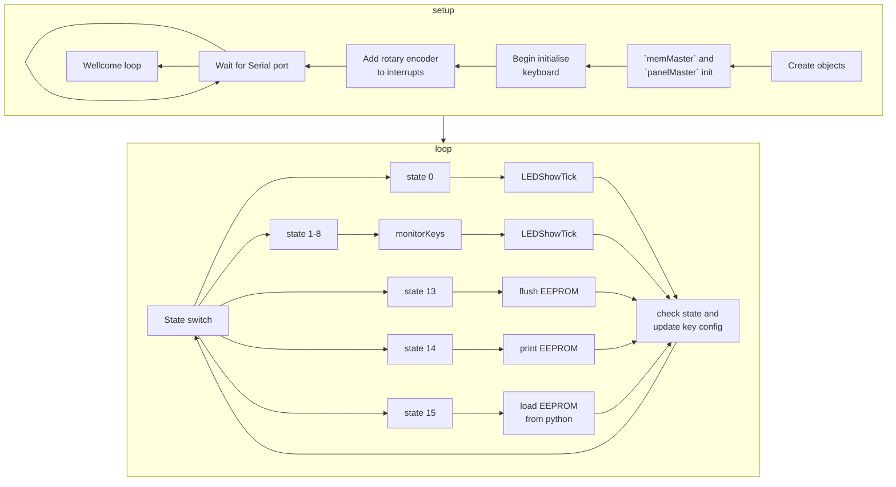

# 10key_macro

A DIY project building an Arduino-based macro keyboard with a 4-bit switch and rotary encoder.

# Background

<!-- The reason for creating this project/ -->
<!-- the why this project is important -->

A number of years ago, I used to learn PIC18 microcontroller and programming using `assembly language`. One of the concepts is using a polling technique to get the button response. Since then I have conducted deep research into designing customized keyboards. Despite there being a huge number of existing projects on the internet, I did want to implement them myself.

# Description

<!-- Describe what it is and what it is included -->

This project mainly consists of four parts. Circuit design, enclosure design, Arduino coding, Python coding.

1. Circuit design

The circuit schematic was built on the EasyEDA platform and is now being ported to KiCAD.

The circuit consists of a microcontroller, 10 cherry keys with 2812 LEDs, an IC74165, an EEPROM AT24C64, a rotary encoder and a 4-bit toggle switch.

By following the schematic, the main circuit was built on a proof board and connected to keys and LEDs through wires.

2. Enclosure design

The enclosure is designed for multiple layers of 4.5mm and 4mm acrylic. The enclosure however begins to fall apart due to aging. A 3D-printed version designed will be reproduced later.

3. Arduino coding

The fundamental idea of the Arduino code design is framing. There are two parts of the Arduino code structure, `setup` and `loop`. I initialize all objects as well as pin I/O in `setup` section; and perform LED and key checks in the loop.

4. Python coding

# Used libraries

This project consisted of several open-source projects. This section aims to acknowledge them to make this project possible.

-   [WS2812](https://github.com/cpldcpu/light_ws2812)

-   [RotaryEncoder](https://github.com/mathertel/RotaryEncoder/)
